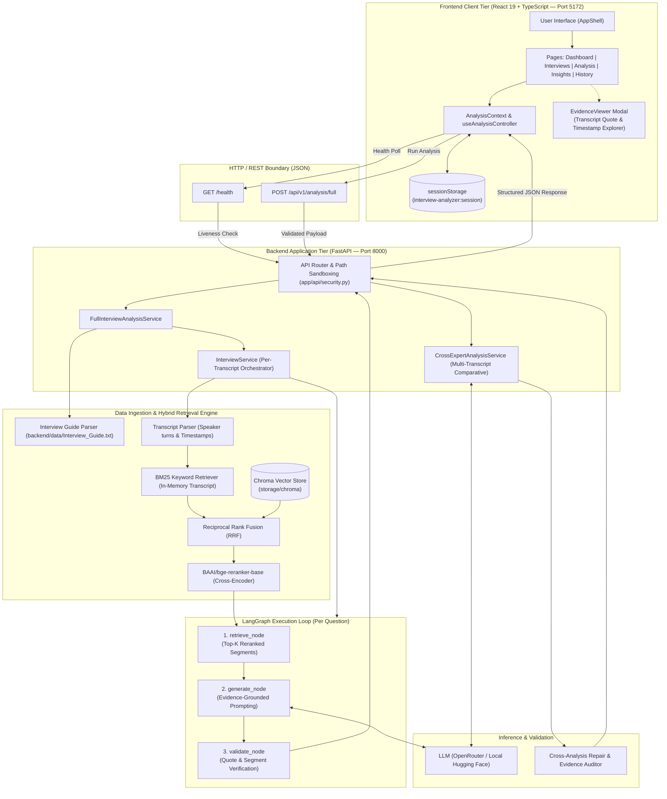

# Interview Analyzer

Interview Analyzer turns expert-call transcripts into structured, evidence-backed answers. It answers each question in a fixed interview guide, attaches exact quotes and timestamps, then compares experts when more than one transcript is analyzed.

The app is a technical case study. The workspace offers three bundled interviews about the European robotic surgery market. It does not accept uploaded files.

---

## What you can do

* Select one or more of the case-study interviews and run a full analysis against the interview guide
* Read each expert's answer, confidence, and supporting quotes with timestamps
* Open an evidence viewer for a specific transcript segment
* Compare common themes, differences, and disagreements when at least two interviews are analyzed
* See whether cross-expert findings passed evidence validation
* Keep the latest result in this browser tab and reopen it from History

The Insights page includes an "Ask across interviews" form. The API has no question endpoint, so that form reports that no answer was generated.

---

## System Architecture & End-to-End Execution Flow

The system is designed as a decoupled, evidence-first AI analysis platform. The React frontend handles user configuration, workflow triggers, and citation exploration. The FastAPI backend orchestrates document ingestion, a multi-stage hybrid retrieval engine, a LangGraph state machine for evidence-backed question answering, and a cross-expert comparative synthesis pipeline with strict validation.

### Complete End-to-End Architecture Diagram



### End-to-End Execution Flow

```text
[User in Browser] 
    │  1. Selects transcripts & clicks "Run Analysis"
    ▼
[AnalysisContext]
    │  2. Verifies API readiness (GET /health)
    │  3. Starts simulated step-timer ("Preparing interviews...", "Extracting evidence...")
    │  4. Dispatches POST /api/v1/analysis/full
    ▼
[FastAPI: app/api/routes/analysis.py]
    │  5. Validates file paths (must reside within backend/data/ or backend/tests/)
    ▼
[FullInterviewAnalysisService]
    │  6. Parses backend/data/Interview_Guide.txt into 6 structured questions
    │  7. Iterates sequentially through each selected transcript:
    │      │
    │      ├─ [IngestionService]: Parses transcript into timestamped speaker turns
    │      ├─ [HybridRetriever]: Indexes in-memory segments with BM25; connects to Chroma
    │      │
    │      └─ [InterviewService & LangGraph Workflow]:
    │             For each of the 6 interview questions:
    │               a. retrieve_node:
    │                  - Queries BM25 (boosts expert answers) & Chroma (semantic embeddings)
    │                  - Merges candidates with Reciprocal Rank Fusion (RRF)
    │                  - Reranks top candidates via BAAI/bge-reranker-base cross-encoder
    │               b. generate_node:
    │                  - Builds grounded prompt with question + top-k evidence segments
    │                  - Calls LLM (OpenRouter or HF) to produce answer, confidence, & cited quotes
    │               c. validate_node:
    │                  - Checks cited quotes against original transcript text
    │                  - Validates segment_id and timestamp integrity
    ▼
[CrossExpertAnalysisService] (Active if ≥ 2 transcripts analyzed)
    │  8. Aggregates all individual expert answers
    │  9. Prompts LLM to identify Common Themes, Differences, and Disagreements
    │ 10. repair_cross_expert_analysis(): Aligns expert names and quote references
    │ 11. validate_cross_expert_analysis(): Verifies all claims link to valid expert evidence
    ▼
[FastAPI Serialization]
    │ 12. Bundles FullAnalysisResponse (experts, cross_analysis, validation status)
    │ 13. Returns HTTP 200 JSON
    ▼
[Frontend Context & UI Rendering]
    │ 14. Runtime schema validation (isFullAnalysisResponse)
    │ 15. Saves response to sessionStorage ('interview-analyzer:session')
    │ 16. Transitions route to /analysis
    │ 17. User navigates per-expert answers, inspects citations in EvidenceViewer modal,
    │     and reviews comparative insights on /insights
```

### Core Architectural Pillars

1. **Strict Evidence Grounding & Anti-Hallucination**:
   - The LLM is never queried without reranked source context.
   - Answers require verbatim quotes and precise time intervals (`mm:ss - mm:ss`).
   - Every returned quote is checked against source transcripts before the answer is accepted.
2. **Multi-Stage Hybrid RAG**:
   - Combines lexical precision (BM25) with conceptual relevance (vector embeddings).
   - Re-ranking through a cross-encoder (`BAAI/bge-reranker-base`) ensures only the highest-signal segments enter the LLM context window.
3. **Deterministic LangGraph State Machine**:
   - Each interview question is resolved within an isolated `InterviewQuestionState` graph, decoupling retrieval, synthesis, and validation into observable, testable stages.
4. **Cross-Expert Synthesis with Automated Repair**:
   - Compares findings across geographical healthcare markets (France, Germany, UK).
   - Findings undergo structural normalization and citation validation to ensure cross-expert claims directly reflect individual transcript evidence.
5. **Interactive Evidence Traceability**:
   - The frontend maintains deep links between synthesized answers, comparative themes, and raw source segments, allowing analysts to audit any claim in the `EvidenceViewer`.

---

## Project structure

```text
Interview_Analyzer/
├── backend/
│   ├── app/
│   │   ├── api/            FastAPI app, routes, schemas
│   │   ├── application/    analysis orchestration
│   │   ├── core/           settings
│   │   ├── domain/         analysis models
│   │   ├── graphs/         LangGraph question pipeline
│   │   ├── ingestion/      transcript and guide parsing
│   │   ├── llm/            model clients and prompts
│   │   ├── retrieval/      keyword, semantic, fusion, rerank
│   │   └── validation/     quote, citation, and cross-analysis checks
│   ├── data/               case-study files (not committed)
│   ├── tests/
│   ├── pyproject.toml
│   ├── uv.lock
│   ├── .python-version     3.14
│   └── README.md
├── frontend/
│   ├── src/
│   │   ├── api/            fetch client
│   │   ├── components/
│   │   ├── context/
│   │   ├── data/catalog.ts fixed interview catalog
│   │   ├── hooks/
│   │   ├── pages/
│   │   └── types/
│   ├── package.json
│   └── README.md
└── README.md
```

Install Python dependencies with `uv sync` from `backend/`. `backend/requirements.txt` is not the dependency source of truth.

---

## Case-study files

Transcripts and the interview guide live in `backend/data/`. That directory is gitignored, so a fresh clone does not include the files. Place these paths relative to `backend/` before running an analysis:

```text
data/Interview_Guide.txt
data/Transcript_1_France.txt
data/Transcript_2_Germany.txt
data/Transcript_3_UK.txt
```

The frontend catalog is fixed to those paths, experts, and roles:

| Transcript | Expert | Role | Market |
| --- | --- | --- | --- |
| Transcript_1_France | Dr. Jean Martin | Head of Urology | France |
| Transcript_2_Germany | Anna Keller | Former Hospital Procurement Director | Germany |
| Transcript_3_UK | Dr. Emily Carter | Consultant Urologist | United Kingdom |

The guide is titled "European Robotic Surgery Market" and has six questions. The API only reads files under `backend/data` and `backend/tests`.

---

## Prerequisites

* Python 3.14 or newer (`backend/.python-version` is `3.14`)
* [uv](https://docs.astral.sh/uv/)
* Node.js 20 or newer
* npm

```bash
python3 --version
uv --version
node --version
npm --version
```

---

## Run locally

Use two terminals.

### Backend

```bash
cd backend
uv sync
cp .env.example .env
```

Set `OPENROUTER_API_KEY` in `backend/.env`, then start the API:

```bash
uv run uvicorn app.api.main:app --reload
```

* API: http://127.0.0.1:8000
* Health: http://127.0.0.1:8000/health
* Swagger: http://127.0.0.1:8000/docs
* ReDoc: http://127.0.0.1:8000/redoc

There is no route at `/`.

### Frontend

```bash
cd frontend
npm install
cp .env.example .env
npm run dev
```

The dev server is http://127.0.0.1:5172. Vite uses port 5172 and will not fall back to another port.

A full analysis calls the LLM once per question per transcript, then again for cross-expert comparison. The first run also downloads the reranker and the configured embedding model. The frontend waits up to 20 minutes by default.

---

## Environment variables

Do not commit `.env` files.

Backend settings come from `backend/app/core/config.py`. Copy `backend/.env.example`. The API process requires `OPENROUTER_API_KEY` even when `LLM_PROVIDER=huggingface`. Host and port come from the uvicorn command, not from environment variables.

Optional backend overrides:

| Variable | Default |
| --- | --- |
| `LLM_PROVIDER` | `openrouter` (`huggingface` for a local model) |
| `LLM_MODEL` | `inclusionai/ling-3.0-flash-fin:free` |
| `HF_LLM_MODEL` | `Qwen/Qwen2.5-3B-Instruct` |
| `EMBEDDING_PROVIDER` | `huggingface` |
| `HF_EMBEDDING_MODEL` | `sentence-transformers/all-MiniLM-L6-v2` |
| `CHROMA_PATH` | `storage/chroma` |
| `CHROMA_COLLECTION` | `expert_transcripts` |
| `RETRIEVAL_TOP_K` | `5` |
| `CORS_ALLOWED_ORIGINS` | localhost and 127.0.0.1 on ports 5172, 5173, and 3000 |

Frontend (`frontend/.env.example`):

```env
VITE_API_BASE_URL=http://127.0.0.1:8000
# Optional. Default is 1200000 (20 minutes).
# VITE_API_TIMEOUT_MS=1200000
```

`VITE_API_BASE_URL` is required. The app does not guess a backend URL.

---

## API

| Method | Path | Purpose |
| --- | --- | --- |
| `GET` | `/health` | Liveness. Does not load models. Returns `status` and `service`. |
| `POST` | `/api/v1/analysis/full` | Analyze the guide and the supplied transcript paths. |

`POST /api/v1/analysis/full` expects `guide_path` and a non-empty `transcripts` list. Each transcript includes `transcript_id`, `expert`, `role`, `market`, and `file_path`. The response contains `experts`, `cross_analysis` (`common_themes`, `differences`, `disagreements`), and `validation`.

Cross-expert analysis runs only when at least two transcripts are analyzed. With one transcript, `validation.valid` is true and the message says cross-expert analysis was skipped.

Interactive docs: http://127.0.0.1:8000/docs

---

## Testing

Backend, from `backend/`:

```bash
uv run pytest
uv run pytest -v
uv run pytest tests/test_api.py -s
```

Frontend, from `frontend/`:

```bash
npm test
```

`npm test` runs Vitest once. `npm run test:watch` keeps it running.

---

## Troubleshooting

**Backend import errors.** Run uvicorn from `backend/` with `uv run`, so the project environment is used.

**Frontend cannot reach the API.** Confirm `VITE_API_BASE_URL=http://127.0.0.1:8000` and that `GET /health` returns `{"status":"ok","service":"interview-analyzer"}`. Restart `npm run dev` after changing `.env`.

**CORS error.** The API allows the Vite origin on port 5172 by default. If you change the frontend origin, set `CORS_ALLOWED_ORIGINS`.

**File not found.** The four case-study files must exist under `backend/data/`. Paths outside `backend/data` and `backend/tests` are rejected.

**Port already in use.** Frontend port 5172 is fixed. For the API, pass `--port` to uvicorn and set `VITE_API_BASE_URL` to that port.

---

## Possible next steps

* A question endpoint for ask-across-interviews
* Uploading transcripts instead of a fixed catalog
* Saving analysis runs on the server
* Authentication and multi-user workspaces
* Export to PDF or CSV
* Streaming model output
* Production deployment, rate limits, and observability
