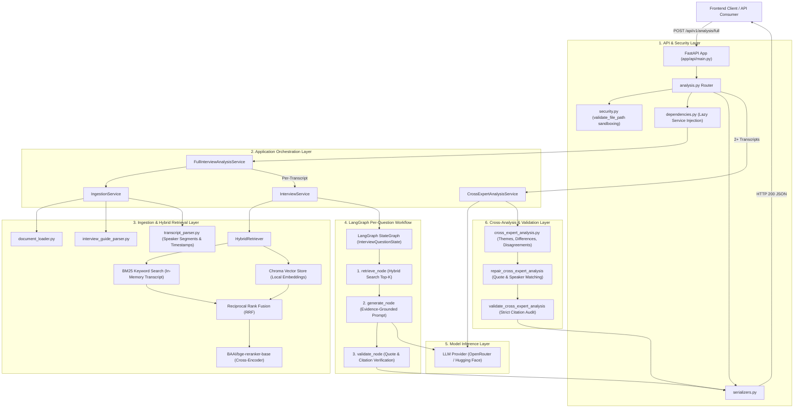

# Interview Analyzer — Backend

Python API for the Interview Analyzer case study. It parses an interview guide and expert transcripts, answers each guide question with cited quotes, and compares experts when more than one transcript is analyzed.

Dependencies are declared in `pyproject.toml` and installed with **uv**. Python **3.14** is required (`requires-python` and `.python-version`).

---

## Tech stack

| Technology | Role |
| --- | --- |
| Python 3.14 | Language |
| FastAPI | HTTP API |
| Uvicorn | ASGI server |
| Pydantic / pydantic-settings | Request, response, and settings models |
| LangChain | Prompts and document types |
| LangGraph | Per-question graph: retrieve, generate, validate |
| Chroma | Local vector store for semantic retrieval |
| rank-bm25 | Keyword retrieval |
| sentence-transformers | `BAAI/bge-reranker-base` reranker |
| PyTorch / Transformers | Local Hugging Face models |
| Pytest | Tests |
| Ruff | Linter (dev dependency, default rules) |
| uv | Environment and lockfile |

LLM calls go to OpenRouter or a local Hugging Face model. Embeddings go to a local Hugging Face model or OpenRouter. Both providers are selected in `.env`.

---

## What the API does

* Checks that `guide_path` and each `file_path` stay inside `data/` or `tests/` and point at a real file
* Parses the interview guide into questions
* Parses each transcript into speaker segments with timestamps
* For every question, retrieves evidence, generates an answer, and checks quotes and citations
* When two or more transcripts succeed, builds common themes, differences, and disagreements and validates them against the expert answers
* Returns a structured JSON body for the frontend

The API does not accept file uploads. Callers send paths to files that are already on disk.

---

## Layout

```text
backend/
├── app/
│   ├── api/
│   │   ├── main.py              app, CORS, routers
│   │   ├── dependencies.py      lazy service construction
│   │   ├── errors.py            error envelope
│   │   ├── security.py          allowed file roots
│   │   ├── serializers.py
│   │   ├── routes/health.py     GET /health
│   │   ├── routes/analysis.py   POST /api/v1/analysis/full
│   │   └── schemas/
│   ├── application/
│   │   ├── full_analysis_service.py
│   │   ├── interview_service.py
│   │   ├── analysis_service.py          cross-expert analysis
│   │   ├── ingestion_service.py
│   │   ├── corpus_service.py            writes Chroma
│   │   └── question_answer_service.py
│   ├── core/config.py
│   ├── domain/
│   ├── graphs/                  LangGraph nodes
│   ├── ingestion/
│   ├── llm/
│   ├── retrieval/
│   └── validation/
├── data/                        gitignored case-study files
├── tests/
├── pyproject.toml
├── uv.lock
├── .python-version
├── .env.example
└── README.md
```

`requirements.txt` is incomplete relative to `pyproject.toml`. Use `uv sync`.

---

## Setup

```bash
cd backend
uv sync
cp .env.example .env
```

`OPENROUTER_API_KEY` is required at startup. `Settings` loads it even when `LLM_PROVIDER` is `huggingface`.

```env
OPENROUTER_API_KEY=your_openrouter_api_key
LLM_PROVIDER=openrouter
EMBEDDING_PROVIDER=huggingface
```

See `.env.example` for the other variables and their defaults. Do not commit `.env`.

Case-study files are not in git. Analysis from the frontend expects these paths relative to `backend/`:

```text
data/Interview_Guide.txt
data/Transcript_1_France.txt
data/Transcript_2_Germany.txt
data/Transcript_3_UK.txt
```

---

## Run

```bash
uv run uvicorn app.api.main:app --reload
```

| URL | What it is |
| --- | --- |
| http://127.0.0.1:8000/health | Liveness. Does not load models. |
| http://127.0.0.1:8000/docs | Swagger |
| http://127.0.0.1:8000/redoc | ReDoc |

`GET /health` returns:

```json
{"status": "ok", "service": "interview-analyzer"}
```

There is no handler for `/`.

CORS allows `localhost` and `127.0.0.1` on ports 5172, 5173, and 3000 unless `CORS_ALLOWED_ORIGINS` is set. The Vite app uses port 5172.

---

## Endpoints

### `POST /api/v1/analysis/full`

Body:

```json
{
  "guide_path": "data/Interview_Guide.txt",
  "transcripts": [
    {
      "transcript_id": "Transcript_1_France",
      "expert": "Dr. Jean Martin",
      "role": "Head of Urology",
      "market": "France",
      "file_path": "data/Transcript_1_France.txt"
    }
  ]
}
```

`transcripts` must contain at least one item. Paths are resolved from the `backend/` directory and must stay under `data/` or `tests/`.

Response shape:

```text
experts[]
  transcript_id, expert, role, market
  answers[]
    question_id, question, answer, confidence
    evidence[]
      segment_id, timestamp, quote, question_id
cross_analysis
  common_themes[]
  differences[]
  disagreements[]
validation
  valid, message
```

With fewer than two analyzed transcripts, cross-expert analysis is skipped, `cross_analysis` is empty, and `validation.valid` is true. With two or more, a failed evidence check leaves `cross_analysis` empty and sets `validation.valid` to false with the service error message. Unexpected failures return HTTP 500.

Error envelope:

```json
{"detail": {"error": {"code": "FILE_NOT_FOUND", "message": "..."}}}
```

| Status | When |
| --- | --- |
| 400 | Path outside the allowed directories, or invalid analysis input |
| 404 | Guide or transcript file is missing |
| 422 | Body does not match the schema |
| 500 | Individual or cross-expert analysis failed unexpectedly |

Responses do not include API keys, prompts, or stack traces.

---

## Backend Architecture & Execution Flow

The backend uses a layered clean architecture. FastAPI acts as the external interface and routes requests to high-level application orchestrators. LangGraph manages the stateful per-question reasoning loop, while a hybrid retrieval engine combines sparse (BM25) and dense (Chroma) search before cross-encoder reranking.

### Architectural Diagram



### Detailed Execution Lifecycle

```text
POST /api/v1/analysis/full
  │
  ├─ 1. Security & Validation
  │    • validate_file_path() confirms guide and transcript paths stay within backend/data/ or backend/tests/
  │    • Input schema validation checks for required fields and non-empty transcripts list
  │
  ├─ 2. Ingestion & Guide Parsing
  │    • IngestionService parses interview guide into structured InterviewQuestion instances
  │    • For each transcript: parses speaker turns and timestamps into timestamped Document segments
  │
  ├─ 3. Per-Transcript Analysis (InterviewService)
  │    • Instantiates HybridRetriever with the parsed transcript documents
  │    • Compiles LangGraph workflow (START → retrieve → generate → validate → END)
  │    • For each guide question:
  │        [retrieve_node]:
  │          - BM25 score over current transcript segments (prioritizing interviewee responses)
  │          - Chroma vector similarity query filtered by transcript_id
  │          - Reciprocal Rank Fusion (RRF) merges candidate lists
  │          - BAAI/bge-reranker-base reranks candidates down to top-k
  │        [generate_node]:
  │          - Formats prompt with question and reranked context segments
  │          - Calls LLM (OpenRouter / HF) requesting answer, confidence score, and verbatim quotes
  │        [validate_node]:
  │          - Verifies each cited quote actually exists in the source transcript
  │          - Confirms segment IDs and timestamps match real speaker segments
  │
  ├─ 4. Cross-Expert Comparative Synthesis (CrossExpertAnalysisService)
  │    • Executed only when ≥ 2 transcripts are provided
  │    • Combines individual expert answers and prompts LLM to discover:
  │        - Common Themes (shared agreements across markets)
  │        - Differences (varying healthcare perspectives/contexts)
  │        - Disagreements (conflicting or contradictory viewpoints)
  │    • Repair Phase: repair_cross_expert_analysis() aligns expert names and quote references
  │    • Validation Phase: validate_cross_expert_analysis() enforces strict evidence backing
  │
  └─ 5. Response Serialization
       • Packages FullAnalysisResponse containing experts array, cross_analysis, and validation status
       • Returns HTTP 200 to client
```

### Hybrid Retrieval Mechanics

Retrieval operates in four stages to eliminate hallucinations while maintaining low latency:

1. **Sparse (BM25) Search**: Indexes in-memory transcript segments for the active request. Tokens from interviewee turns receive higher priority over interviewer questioning.
2. **Dense (Chroma) Vector Search**: Queries the local persistent Chroma vector store (`storage/chroma`) using embeddings (`sentence-transformers/all-MiniLM-L6-v2` or OpenRouter). Results are strictly constrained to the current `transcript_id`.
3. **Reciprocal Rank Fusion (RRF)**: Merges the sparse and dense rank lists to handle both exact technical terminology and semantic variations. If Chroma contains no matching entries, BM25 fallback is automatically utilized.
4. **Cross-Encoder Reranking**: The fused candidates are evaluated by `BAAI/bge-reranker-base`, scoring question-segment pairs to select the top-k most relevant evidence segments.

---

## Tests

From `backend/`:

```bash
uv run pytest
uv run pytest -v
uv run pytest -s
uv run pytest tests/test_api.py -s
uv run pytest tests/test_cross_analysis_validator.py -s
```

API tests mock the analysis services so they do not load models. Retrieval and quality tests may load local models and need the data files.

Ruff is installed with the dev group. There is no project-specific Ruff config, so the default rule set applies:

```bash
uv run ruff check .
```

---

## Add an endpoint

Keep route functions thin:

```text
router → request schema → application service → response schema
```

Construct services through `app/api/dependencies.py` so importing the app does not load the LLM. `GET /health` must stay free of model loading.

---

## Run with the frontend

Terminal 1:

```bash
cd backend
uv run uvicorn app.api.main:app --reload
```

Terminal 2:

```bash
cd frontend
npm install
npm run dev
```

The frontend expects `VITE_API_BASE_URL=http://127.0.0.1:8000`.

---

## Troubleshooting

**`ModuleNotFoundError`.** Run commands from `backend/` with `uv run`.

**Missing dependencies.** Run `uv sync`.

**Settings fail on import.** `OPENROUTER_API_KEY` is missing from `backend/.env`.

**`FILE_NOT_FOUND` or `INVALID_PATH`.** Put files under `backend/data/` and send paths such as `data/Transcript_1_France.txt`.

**Port 8000 is taken.**

```bash
uv run uvicorn app.api.main:app --reload --port 8001
```

Point `VITE_API_BASE_URL` at the same port.

---

## Before a production deploy

The current service is a local case-study API. A deployment would still need authentication, rate limits, secret management, HTTPS, persistent run storage, request size limits, structured logging, and monitoring. File access is already limited to `data/` and `tests/`.
