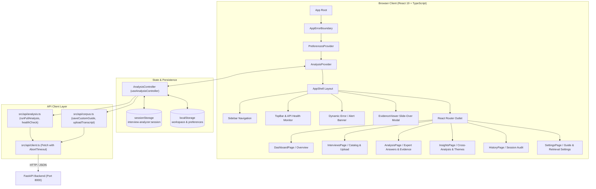

# Interview Analyzer — Frontend

React application for running the case-study interview analysis and reading the API result. Users select interviews from a fixed catalog, start one full analysis, and review answers, quotes, themes, and disagreements.

AI analysis stays in the backend. This app sends the catalog's file paths and renders the JSON response.

---

## Tech stack

| Technology | Role |
| --- | --- |
| React 19 | UI |
| TypeScript | Types aligned with the FastAPI schemas |
| Vite 7 | Dev server, build, and preview |
| React Router 7 | Pages |
| Vitest + Testing Library | Tests |
| Custom CSS (`src/index.css`) | Layout and components |

## Architecture & Component Flow

The frontend is structured as a reactive single-page application (SPA) centered around an analysis controller hook (`useAnalysisController`) and React Context (`AnalysisContext`). State transitions from user configuration to full analysis execution, evidence exploration, and session persistence.

### Architectural Diagram



### Component & Page Hierarchy

```text
src/
├── App.tsx                           # Root router & Error Boundary
│   └── AppShell                      # Shell layout (persistent navigation & modals)
│       ├── Sidebar                   # Navigation links & active route indicator
│       ├── TopBar                    # API health status badge (GET /health)
│       ├── EvidenceViewer            # Global drawer/modal for inspecting cited transcript segments
│       └── <Outlet />
│           ├── DashboardPage (/)     # Guide summary, expert roster, "Run Analysis" CTA
│           ├── InterviewsPage        # Catalog view, transcript metadata, selection checkboxes
│           ├── AnalysisPage          # Per-expert tabs, questions, answers, confidence & quote cards
│           ├── InsightsPage          # Cross-expert themes, disagreements, position breakdown
│           ├── HistoryPage           # Run review from current browser session
│           └── SettingsPage          # Guide switching (bundled vs custom) & top-k tuning
```

### State Management & Data Flow

1. **Workspace & Preferences Initialization**:
   - `PreferencesProvider` loads user preferences (`localStorage`) such as guide selection and custom API parameters.
   - `AnalysisProvider` wraps `useAnalysisController`, initializing selected transcripts and guide questions from workspace cache or bundled defaults (`src/data/catalog.ts`).
2. **Analysis Execution Flow**:
   ```text
   User clicks "Run Analysis"
           │
           ▼
   Verify health status (GET /health)
           │
           ▼
   Set status = "running" & start rotating progress labels:
     "Preparing interviews..." → "Analyzing responses..." → "Extracting evidence..." → "Validating..."
           │
           ▼
   POST /api/v1/analysis/full via src/api/analysis.ts
     Payload: { guide_path, retrieval_top_k, transcripts: [...] }
           │
           ├── [Success]
           │     Validate payload with runtime type guard (isFullAnalysisResponse)
           │     Save session to sessionStorage ('interview-analyzer:session')
           │     Set status = "success"
           │     Navigate to /analysis
           │
           └── [Failure]
                 Parse error payload (ApiError)
                 Set status = "error"
                 Render user-facing error banner in AppShell
   ```
3. **Evidence Inspection Flow**:
   - Each answer on `AnalysisPage` displays cited quotes with timestamps (e.g., `04:12 - 04:45`).
   - Clicking an evidence badge calls `openEvidence(resolvedEvidence)`.
   - `AppShell` detects active evidence and mounts `EvidenceViewer`.
   - The user can inspect the exact verbatim quote, speaker turn, question context, and step through citations sequentially (`showEvidenceAt`).
4. **Cross-Expert Synthesis Presentation**:
   - `InsightsPage` consumes `session.response.cross_analysis`.
   - Components render:
     - `ThemeList`: Shared market insights across analyzed experts.
     - `DisagreementList`: Direct contradictions identified between expert answers.
     - `PositionSummary`: Breakdown of individual expert stances.
     - `MarketComparison`: Geographic comparison across countries (France, Germany, UK).

---

| Route | Page | What it shows |
| --- | --- | --- |
| `/` | Overview | Interview guide, expert cards, and Run Analysis |
| `/interviews` | Interviews | The three catalog transcripts and whether this session analyzed them |
| `/analysis` | Analysis | Per-expert answers, confidence, evidence, and validation |
| `/insights` | Insights | Common themes, disagreements, positions, market comparison, and the ask form |
| `/history` | History | The latest run stored in this browser tab |

The top bar calls `GET /health` and shows API Ready, API Unavailable, or Analysis Running.

All interviews in `src/data/catalog.ts` start selected. The Run Analysis button stays disabled until at least one interview is selected. A successful run navigates to `/analysis`.

The latest result is stored in `sessionStorage` under `interview-analyzer:session`. History shows that run until the tab closes. The API does not store past runs.

The Insights "Ask across interviews" form is a placeholder. `askAcrossInterviews()` does not call the backend, because `POST /api/v1/analysis/full` is the only analysis route. Submitting the form tells the user that no question endpoint exists.

---

## Layout

```text
frontend/
├── src/
│   ├── api/
│   │   ├── client.ts       fetch, timeouts, error parsing
│   │   ├── analysis.ts     health and full analysis
│   │   ├── errors.ts
│   │   └── guards.ts
│   ├── components/
│   │   ├── analysis/       workspace, answers, evidence, insights
│   │   ├── layout/         shell, sidebar, top bar
│   │   └── ui/
│   ├── context/AnalysisContext.tsx
│   ├── data/catalog.ts     guide and three transcripts
│   ├── hooks/useAnalysis.ts
│   ├── lib/                session, evidence, metrics
│   ├── pages/
│   ├── types/analysis.ts   API contract
│   ├── test/
│   ├── App.tsx
│   ├── main.tsx
│   └── index.css
├── index.html
├── package.json
├── package-lock.json
├── vite.config.ts
├── tsconfig.json
├── .env.example
└── README.md
```

There is no `public/` directory and no `src/services/` folder. API calls live in `src/api/`.

---

## Requirements

* Node.js 20 or newer
* npm
* The backend API from `../backend`

---

## Setup

```bash
cd frontend
npm install
cp .env.example .env
```

`.env.example`:

```env
VITE_API_BASE_URL=http://127.0.0.1:8000
# Optional. Full analysis can take several minutes. Default is 20 minutes.
# VITE_API_TIMEOUT_MS=1200000
```

`VITE_API_BASE_URL` is required. Restart the dev server after changing it. Do not commit `.env` if it contains anything other than this local URL.

---

## Run

Start the API first. From `backend/`:

```bash
uv run uvicorn app.api.main:app --reload
```

Then:

```bash
npm run dev
```

Open http://127.0.0.1:5172. `vite.config.ts` sets `strictPort: true` on port **5172**. If that port is taken, Vite exits instead of moving to 5173.

The catalog sends these backend-relative paths:

```text
data/Interview_Guide.txt
data/Transcript_1_France.txt
data/Transcript_2_Germany.txt
data/Transcript_3_UK.txt
```

Those files must exist under `backend/data/`. See the backend README. The UI cannot add or upload other transcripts.

While a run is in progress the overview shows rotating progress labels. Those labels are a timer in the browser. They are not status events from the API. The request uses one `POST` and waits until the full body returns, or until `VITE_API_TIMEOUT_MS` (default 1,200,000 ms).

---

## Scripts

| Command | Effect |
| --- | --- |
| `npm run dev` | Vite on port 5172 |
| `npm test` | Vitest once |
| `npm run test:watch` | Vitest in watch mode |
| `npm run build` | `tsc --noEmit` and production build |
| `npm run preview` | Serve `dist/` on port 4173 |

`npm run build` writes `dist/`, which can be hosted as a static site. The built app still needs `VITE_API_BASE_URL` baked in at build time, and the API must allow that site's origin through `CORS_ALLOWED_ORIGINS`.

---

## API client

```text
pages and components
        ↓
AnalysisContext / useAnalysis
        ↓
src/api/analysis.ts
        ↓
src/api/client.ts
        ↓
FastAPI
```

`src/types/analysis.ts` matches `backend/app/api/schemas/analysis.py` and `health.py`. Evidence is `segment_id`, `timestamp`, `quote`, and optional `question_id`. An expert result is a list of guide answers, not a single summary string.

Failed responses use the backend envelope `detail.error.code` and `detail.error.message`. Network failures, timeouts, and malformed JSON become `ApiError` values and a banner in the shell. Development builds can expand the status code. Production builds hide that detail.

---

## Tests

```bash
npm test
```

Tests render the app with Testing Library and do not need a running API.

---

## Troubleshooting

**Dev server will not start.** Port 5172 is already in use, or `node_modules` is stale:

```bash
rm -rf node_modules
npm install
npm run dev
```

**API Unavailable.** `VITE_API_BASE_URL` must be the origin where uvicorn is listening, usually `http://127.0.0.1:8000`. Check `GET /health`.

**CORS error.** The API allows port 5172 by default. A different UI origin has to be listed in `CORS_ALLOWED_ORIGINS` on the backend.

**Analysis ends in an error banner.** The case-study files are missing from `backend/data/`, or the model call failed. The banner text comes from the API error message.

**UI changes do not appear.** Restart `npm run dev` after `.env` edits. Source edits are picked up by Vite's reload.

---

## Possible next steps

* Wire "Ask across interviews" to a real question endpoint
* Let users add transcripts instead of the fixed catalog
* Persist more than the current browser-tab session
* Export a run
* Stream progress from the API instead of rotating local labels
